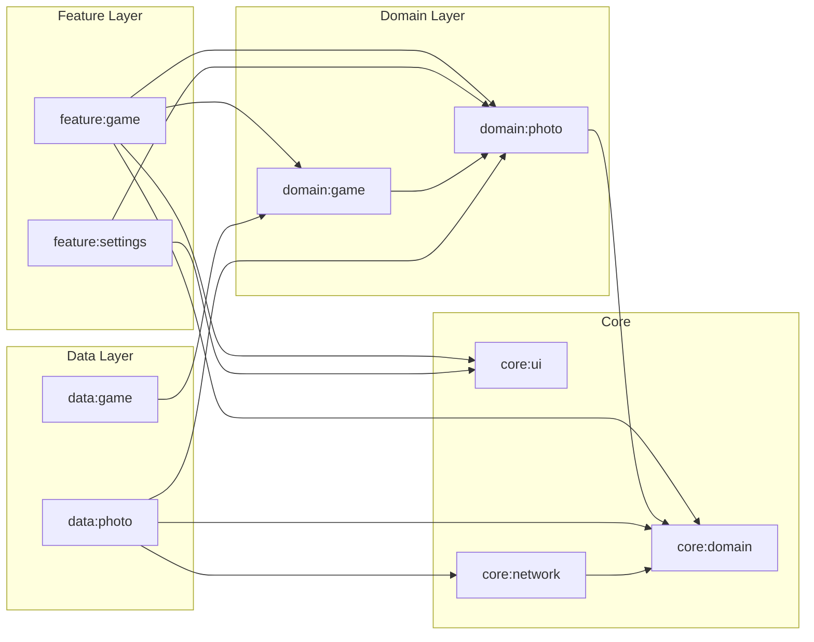

# Where Am I?

A geography guessing game for Android: you're shown a geotagged photo and must drop a pin on the map where you think it was taken. Five rounds, Haversine scoring, leaderboard.


---

## What it does

1. A geotagged photo is fetched from Flickr or the BenHikes API.
2. The player places a pin on a map to guess the location.
3. A score is calculated from the great-circle distance (Haversine formula) between the guess and the actual coordinates.
4. After 5 rounds the cumulative score is saved to the leaderboard.

---

## Architecture

Clean Architecture + MVI, strictly layered with unidirectional dependencies:



---

## Module map

| Module | Role |
|---|---|
| `:app` | Entry point, Hilt setup, Compose Navigation host |
| `:feature:game` | Game screen, leaderboard screen, ViewModels |
| `:feature:settings` | Photo source toggle (Flickr / BenHikes) |
| `:domain:game` | Game models, scoring use cases, high score repository interface |
| `:domain:photo` | Photo model, `GetRandomGeotaggedPhotoUseCase`, repository interface |
| `:data:photo` | `PhotoRepositoryImpl`, Flickr + BenHikes data sources, DataStore |
| `:data:game` | `HighScoreRepositoryImpl`, Room database + DAO |
| `:core:network` | Hilt module: shared OkHttpClient, Moshi |
| `:core:ui` | Material 3 theme only |
| `:core:domain` | Shared models and `Result<T, E>` wrapper |

---

## Tech stack

- **Jetpack Compose** — entire UI, MVI pattern, `StateFlow<UiState>`
- **Google Maps SDK** — interactive pin-drop for guessing
- **Hilt** — dependency injection throughout
- **Room** — local persistence for high scores
- **Moshi + KSP** — JSON deserialisation (DTOs in data modules)
- **DataStore** — settings persistence (selected photo source)
- **Coroutines + Flow** — async and reactive throughout
- **Flickr API** — primary geotagged photo source (100 photos per call)
- **BenHikes API** — secondary photo source (custom endpoint)
- **detekt** — static analysis, enforced in CI

---

## Build & setup

### Prerequisites

1. Copy the template and fill in your API keys:
   ```
   cp local.properties.template local.properties
   ```
   Then edit `local.properties`:
   ```
   FLICKR_API_KEY=<your Flickr API key>
   MAPS_API_KEY=<your Google Maps API key>
   BENHIKES_BASE_URL=<base URL for the BenHikes API>
   ```
   > `local.properties` is gitignored and never committed.

2. Install to a connected device or emulator:
   ```
   ./gradlew installDebug
   ```

---

## Test & lint

```bash
./gradlew test                   # all unit tests
./gradlew :domain:game:test      # single-module tests
./gradlew detekt                 # static analysis
./gradlew check                  # lint + tests combined
./gradlew connectedAndroidTest   # instrumented tests (requires device/emulator)
```
